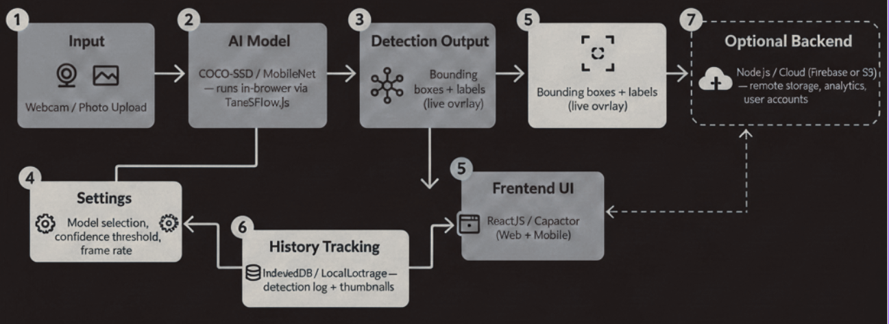
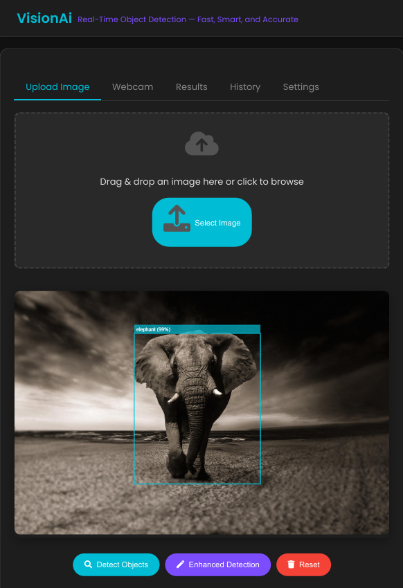

<table>
<tr>
<td width="150">
<!-- 🖼️ LOGO: VisionAI project logo, shown to the left of the title. Place at images/VisionAI_banner.jpg -->

</td>
<td>

# VisionAI
### Real-Time Object Detection — Web & Android

</td>
</tr>
</table>


**Lightweight, On-Device AI Object Detection powered by TensorFlow.js**

Built with COCO-SSD · MobileNet · TensorFlow.js · Android WebView

[](#)
[](https://www.tensorflow.org/js)
[](#)
[](#license)

</div>

---

## 📖 Overview

**VisionAI** is a real-time object detection system that runs entirely on-device — no server, no GPU required. It uses **COCO-SSD** and **MobileNet**, two lightweight AI models, executed via **TensorFlow.js**, to detect and localize multiple objects in both static images and live webcam/camera streams.

The project started as a **web application** (HTML, CSS, JavaScript) and was later converted into a **fully functional Android app** using **Android Studio + WebView integration**, preserving every web feature while gaining native camera, storage, and internet permissions.

This project was developed for the course *21CSO353T – Mobile Application Development*, Semester VI (2025–26), Department of Computational Intelligence, SRM Institute of Science and Technology.

> Aligned with **SDG 4** (Quality Education), **SDG 9** (Industry, Innovation and Infrastructure), and **SDG 10** (Reduced Inequalities) — VisionAI makes AI-powered object detection accessible on everyday devices, without specialized hardware.

---

## ✨ Features

- 🖼️ **Image Upload Detection** — drag-and-drop or browse to detect objects in static images
- 🎥 **Real-Time Webcam Detection** — live, continuous frame-by-frame object detection
- 🟦 **Bounding Box Visualization** — labeled boxes with live confidence scores
- 🔊 **Voice Announcements** — Text-to-Speech feedback via the Web Speech API
- 🧠 **Multi-Model Detection** — combine COCO-SSD + MobileNet for improved coverage
- 📊 **Detection Results Dashboard** — object count, average confidence, and processing time
- 🕓 **History Tracking** — persistent local log of past detections with thumbnails & stats
- ⚙️ **Configurable Settings** — confidence threshold, model choice, detection quality mode
- 📱 **Native Android App** — packaged via WebView with Camera, Storage & Internet permissions

---

## 🎯 Problem Statement

Object detection is central to security, retail, healthcare, and smart-city applications — yet most systems demand expensive GPUs and deep ML expertise, leaving them inaccessible to students and everyday users. Existing browser-based demos rarely ship with history tracking, voice feedback, or a path to a native mobile app. **VisionAI** closes this gap with a lightweight, in-browser AI pipeline that runs on ordinary laptops and smartphones — with a complete, production-style feature set — and is fully repackaged as a native Android application.

## 🎯 Research Objectives

- Build a browser-based real-time object detection app using TensorFlow.js (COCO-SSD + MobileNet), with zero server-side processing
- Provide a complete UI: image upload, live webcam detection, bounding boxes, voice feedback, configurable settings
- Implement local history tracking (thumbnails, metadata, stats) for reviewing past detections
- Convert the web app into a native Android application via Android Studio + WebView
- Evaluate detection accuracy, latency, and usability across input modes and devices

---

## 🏗️ System Architecture

VisionAI follows a **layered architecture**: native Android input (camera/gallery) → on-device AI inference → detection processing → visualization overlay → local history storage — all governed by user-configurable settings, and bridged to the web layer through Android WebView.

<!-- 🖼️ IMAGE: Figure 3.1 from report — VisionAI Android Application Architecture block diagram. Place at images/block_diagram.jpg -->
<p align="center">
  
</p>

### Component Breakdown

| # | Component | Description |
|---|---|---|
| 1 | **App Input (Camera/Photo)** | Captures input via device camera or media gallery. Requires `CAMERA`, `READ_EXTERNAL_STORAGE`. |
| 2 | **On-Device AI Model** | Runs COCO-SSD & MobileNet via TensorFlow Lite/TensorFlow.js for low-latency, private inference. |
| 3 | **Detection Processing** | Generates bounding boxes, class labels, and confidence scores per frame/image. |
| 4 | **Visualization Overlay** | Renders live bounding boxes/labels on Canvas, TextureView, or SurfaceView. |
| 5 | **App Settings & Voice Control** | Model selection, confidence threshold, detection quality, TTS voice feedback. |
| 6 | **Local History Tracking** | Persists detection logs + thumbnails locally via LocalStorage / Room (SQLite). |
| 7 | **Android App Logic & UI** | Java/Kotlin + Android Views (or Jetpack Compose) managing navigation & integration. |
| 8 | **Cloud Integration (Optional)** | Optional Firebase/AWS hook for remote storage, analytics, and accounts. |

---

## 🛠️ Tools & Software Used

| Category | Tool / Software | Purpose |
|---|---|---|
| Development IDE | Android Studio | Convert website → Android app, build APK |
| Programming Languages | HTML, CSS, JavaScript | Build the VisionAI web application |
| AI Framework | TensorFlow.js | Run AI models directly in the browser |
| AI Models | COCO-SSD, MobileNet | Object detection & image classification |
| Web APIs | WebRTC (`getUserMedia`) | Access webcam for real-time detection |
| Browser Features | Canvas API | Draw bounding boxes and detection overlays |
| Voice Feature | Web Speech API | Voice output for detected objects |
| Storage | LocalStorage / Room (SQLite) | Store detection history locally |
| Web-to-App | Android WebView | Run the website inside the Android app |
| Permissions | Camera, Internet, Storage | Enable webcam, model loading, file access |
| Testing | Android Emulator / Real Device | Functional testing |

---

## 📁 Repository Structure

> ℹ️ **Note:** VisionAI's Android app is a WebView wrapper around this website, so the Android Studio project isn't part of this repo. This repository hosts the **web application only** — a single self-contained `index.html` (with TensorFlow.js loaded via CDN) — plus the supporting images and documentation.

```
VisionAI/
├── index.html                   # Single-file web app (HTML + CSS + JS + TensorFlow.js)
├── images/                      # Logo + diagrams used in this README
│   ├── VisionAI_banner.jpg      # project logo, shown at the top
│   ├── block_diagram.jpg        # system architecture diagram
│   ├── upload_image_interface.jpg
│   └── webcam_detection_interface.jpg
├── docs/
│   └── VisionAI_Full_Report.pdf # Full project report
└── README.md
```

---

## 🎥 Interface Preview

VisionAI was validated across both the web platform and Android devices — all core features (image detection, live webcam detection, history tracking, and settings) function as expected. Since the full app is live and interactive, only the two primary detection modes are previewed below; the rest (results, history, settings) can be explored directly in the running site.

### 1. Upload Image Interface
Drag-and-drop or browse to submit a static image. Offers **Detect Objects** (single model), **Enhanced Detection** (multi-model), and **Reset**, with labeled bounding boxes and confidence scores.

<!-- 🖼️ IMAGE: Figure 4.1 — Upload Image Interface with Bounding Box Detection. Place at images/upload_image_interface.jpg -->
<p align="center">
  
</p>

### 2. Webcam Detection Interface
Real-time, video-based detection using the device camera — **Start Webcam**, **Capture Frame**, **Live Detection**, and **Stop** controls, plus frame download options.

<!-- 🖼️ IMAGE: Figure 4.2 — Webcam Detection Interface (Android App). Place at images/webcam_detection_interface.jpg -->
<p align="center">
  
</p>

---

## 🚀 Getting Started

1. Clone the repo:
   ```bash
   git clone https://github.com/<your-username>/VisionAI.git
   cd VisionAI
   ```
2. Open `index.html` directly in a browser, or serve it locally for full webcam support:
   ```bash
   npx serve .
   # or
   python3 -m http.server 8000
   ```
3. Allow camera permissions when prompted to use real-time webcam detection.
4. Upload an image or start the webcam to begin detecting objects.

> 📱 **About the Android version:** VisionAI was also packaged as a native Android app by wrapping this same website in an Android WebView (with Camera, Storage, and Internet permissions). The Android Studio project itself isn't hosted in this repo — see the [project report](docs/VisionAI_Full_Report.pdf) for full details on that conversion process.

---

## 🔮 Future Scope

- On-device fine-tuning for custom/domain-specific object classes
- Offline model caching for fully airplane-mode operation
- Optional Firebase/AWS cloud sync for cross-device history
- Integration of newer lightweight detectors (e.g., YOLO-Nano variants) for improved accuracy

---

## 📚 References

1. Redmon, J., Divvala, S., Girshick, R., & Farhadi, A. (2016). *You Only Look Once: Unified, Real-Time Object Detection.* CVPR. DOI: 10.1109/CVPR.2016.91
2. Howard, A. G. et al. (2017). *MobileNets: Efficient Convolutional Neural Networks for Mobile Vision Applications.* arXiv:1704.04861
3. Liu, W. et al. (2016). *SSD: Single Shot MultiBox Detector.* ECCV. DOI: 10.1007/978-3-319-46448-0_2
4. Smilkov, D. et al. (2019). *TensorFlow.js: Machine Learning for the Web and Beyond.* SysML Conference. arXiv:1901.05350

Full reference list and detailed analysis available in the [project report](docs/VisionAI_Full_Report.pdf).

---

## 👤 Author

Developed under the guidance of **Dr. S. Karthick**, Department of Computational Intelligence, SRM Institute of Science and Technology.

- Parnapalli Anish

## 📄 License

This project is open-sourced for educational use. Add your preferred license (e.g., MIT) here.
